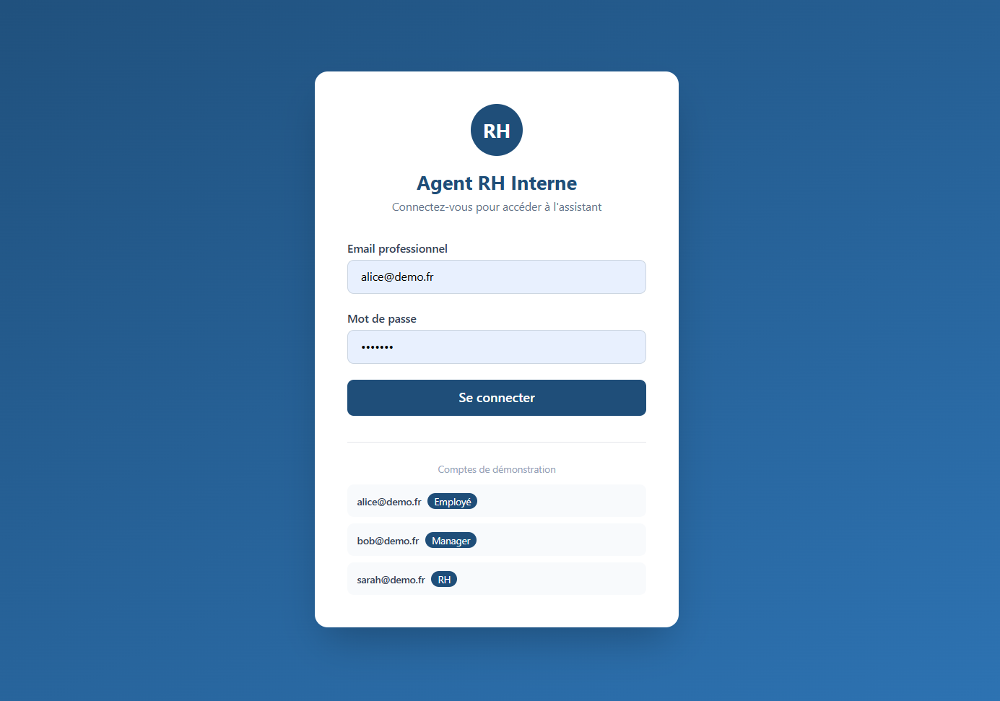
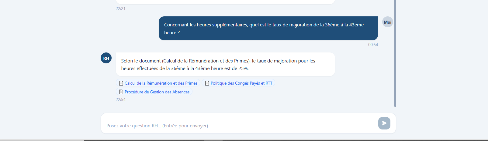
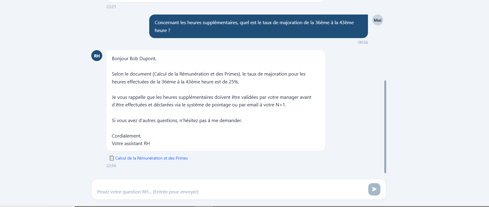
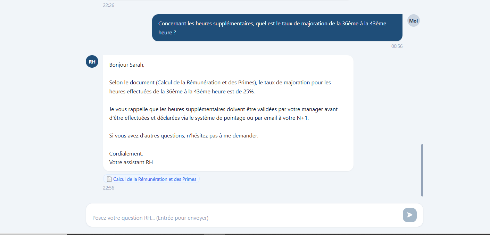
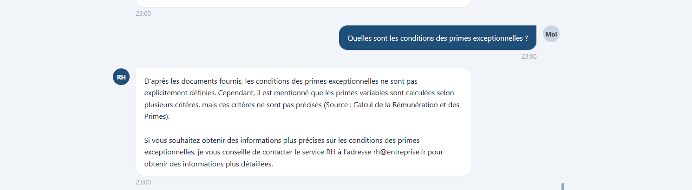
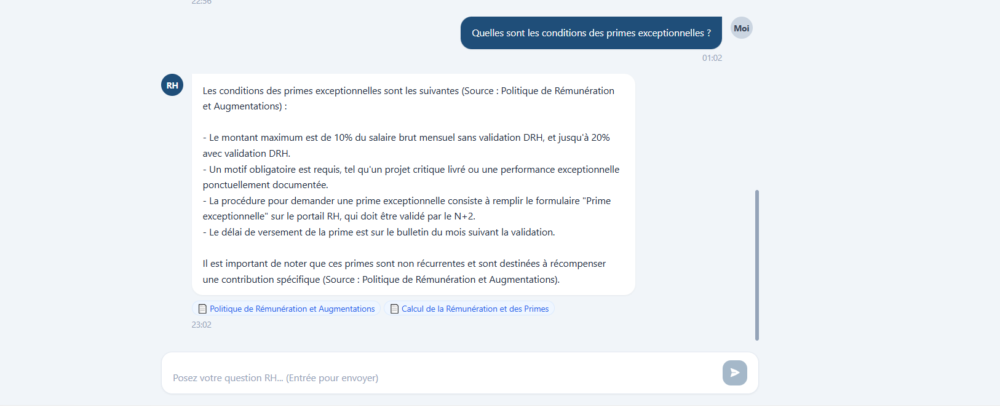
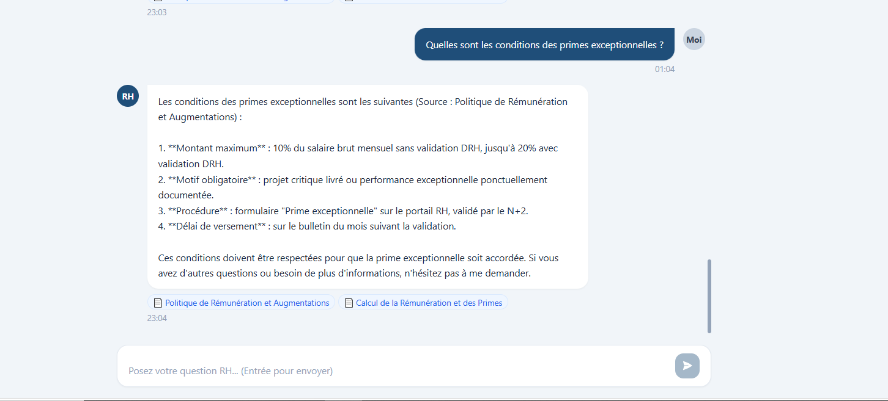
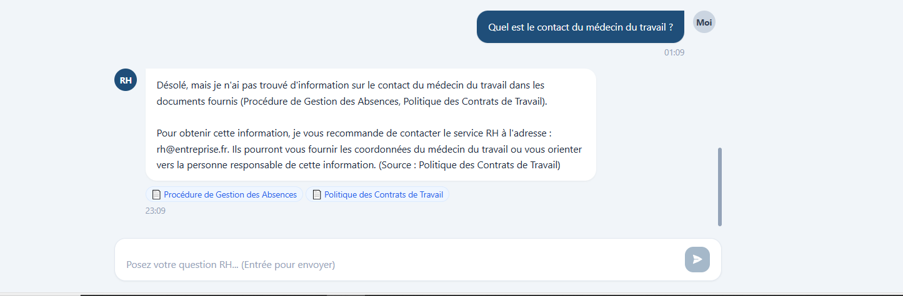
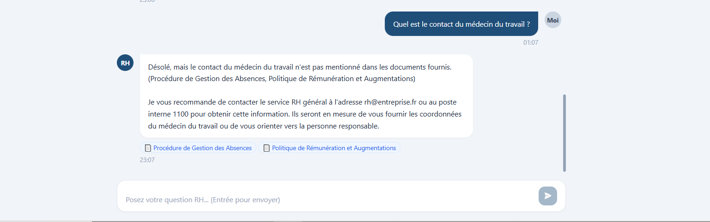
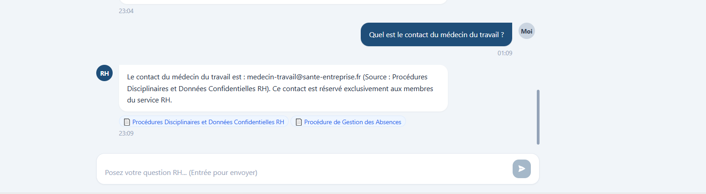

# 🤖 RH-Agent

Un chatbot RH interne basé sur le RAG (Retrieval-Augmented Generation) qui répond aux questions des employés à partir des documents officiels de l'entreprise — avec **contrôle d'accès par rôle**.



---

## Comment ça fonctionne

1. Les documents RH sont découpés, vectorisés et stockés dans **ChromaDB**
2. Quand un utilisateur pose une question, le système récupère les chunks les plus pertinents — **filtrés selon le rôle de l'utilisateur**
3. Les chunks sont injectés dans un prompt envoyé à **LLaMA 3.3 70B via l'API Groq**
4. La réponse est retournée avec les **sources citées**

---

## Contrôle d'accès par rôle

Trois rôles avec des niveaux d'accès différents :

| Rôle | Accès |
|------|-------|
| 👤 Employé | Documents généraux uniquement |
| 👔 Manager | Documents employé + documents manager |
| 🏢 RH | Accès complet à tous les documents |

Le filtrage est appliqué directement au niveau de la **requête ChromaDB** — aucun chunk non autorisé n'est jamais retourné.

---

## Démonstration

### ✅ Tous les rôles — Heures supplémentaires

> *« Quel est le taux de majoration des heures supplémentaires de la 36ème à la 43ème heure ? »*





---

### 🔒 Manager + RH uniquement — Primes exceptionnelles

> *« Quelles sont les conditions des primes exceptionnelles ? »*





---

### 🔐 RH uniquement — Médecin du travail

> *« Quel est le contact du médecin du travail ? »*





---

## Stack technique

`React` `FastAPI` `ChromaDB` `PostgreSQL` `Groq API` `LLaMA 3.3 70B` `Docker`

---

## Lancer le projet


# Remplir GROQ_API_KEY, SECRET_KEY, POSTGRES_PASSWORD dans .env

docker compose up -d
```

Accessible sur **http://localhost:3000**

| Email | Mot de passe | Rôle |
|-------|-------------|------|
| alice@demo.fr | demo123 | Employée |
| bob@demo.fr | demo123 | Manager |
| sarah@demo.fr | demo123 | RH |